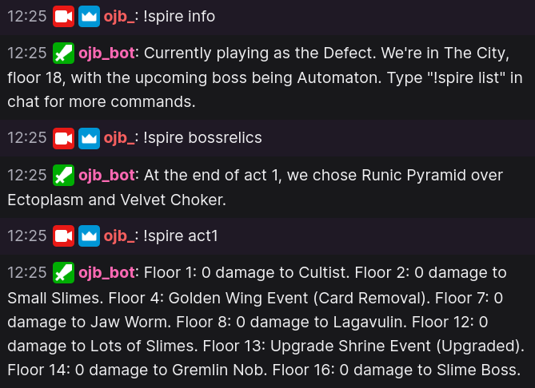

# SpireBot
A mod for Slay the Spire with an integrated Twitch chat bot. It enables viewers in chat to access details usually only available on the run history screen at any time during the stream. This mod is currently WIP and has a number of known bugs.



## Prerequisites
* A secondary Twitch account to run the bot
* ModTheSpire (available on the Steam Workshop)
* BaseMod (available on the Steam Workshop)

## Instructions

We need to set up credentials to navigate the Twitch API in order for the bot to listen and respond to chat messages. It is *highly* recommended you use a secondary account for this, both for security purposes and general usability.

1. Create a new twitch.tv account for your bot and log in to that account. When you generate the oauth key, you want it to be for the bot account and not your main account, so make sure you're logged in correctly!
2. Download both **SpireBot.jar** and **spirebot_cred.json** from the most recent release on the [Releases page](https://github.com/casey-c/spirebot/releases), and place them into your *SlayTheSpire/mods* folder
3. Open **spirebot_cred.json** in a text editor so that we can edit in our required credentials. For Windows, this is something like Right click -> Open With Notepad. We'll be filling out the details in the following steps.
4. Use [https://www.twitchapps.com/tmi/](https://www.twitchapps.com/tmi/) to generate an oauth key that we will need to manage the bot. **IMPORTANT:** keep this key secret - treat it as a password and don't show on stream! Copy this to your clipboard and replace "YOUR_OAUTH_HERE" with this key. (Keep the quotation marks and the leading oauth:.)
5. Replace "BOT_USERNAME_HERE" with the name of your bot account.
6. Replace "TARGET_CHANNEL_HERE" with the name of your actual Twitch channel that you will be streaming from.
7. We should now have a working credentials file. If you did everything right, it should look something like:
    ```json
    {
      "oauth": "oauth:12345fake23asdf83r",
      "username": "ojb_bot",
      "channel": "ojb_"
    }  
    ``` 
  8. Save and quit out of Notepad / your text editor. Remember, this file has a plaintext oauth key, so it should be treated as a secret password! Don't show the contents of this .json file to anyone!
  9. Now we can try and launch SlayTheSpire ("Play with mods") to see if it worked. Make sure to check the checkboxes in the ModTheSpire to enable both BaseMod and SpireBot so that the game launches with the mod. 
  10. If everything worked correctly, your bot should join your chat with a message "BOT_USERNAME has joined the chat". Once that message is shown, you can try and interact with your bot by typing "!spire help" into chat. If something went wrong and you get no responses, double check to make sure you didn't screw up your JSON file. Reread over it carefully and compare to the example above to make sure you have the right details in the right places and no misplaced quotation marks or commas.
  
  ## Features
  More features are planned for future updates. For now, these commands provide some starter information about the run.
  
  * !spire list - Lists out all commands the bot responds to.
  * !spire help - Prints a help message.
  * !spire seed - Prints the current seed if in a run.
  * !spire info - Prints some basics about the current run. (WIP/Buggy)
  * !spire act1 - (also act2, etc.) Shows what we encountered on different floors.
  * !spire hp - Shows hp values at different points in the run (bugged - stops working once it exceeds 500 chars in length mid act 2)
  * !spire bossrelics - Shows boss relics offered and picked
  * !spire slice - A very important command that tracks the times "Slice" is seen (and picked of course - you wouldn't want to miss out on 5 free damage!)
  
  ## Notes
 
 * Please make your bots into moderators so that they can send more messages / minute. This mod still needs some spam mitigation and self imposed limits to handle larger chats.
 * There are some issues with Rests/Shops not being tracked properly in the act commands
 * There are only a limited number of characters allowed per comment (500) - so commands that spit out tons of text info (e.g. !spire hp) will simply not have a response in game. I want to fix this eventually!
  
  
  
  
  
  
